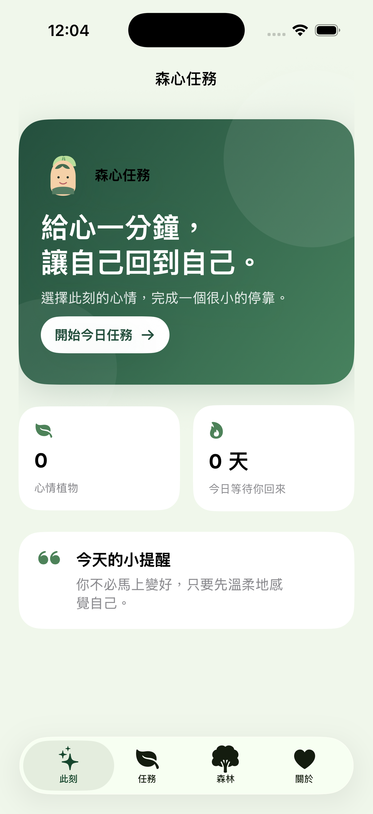
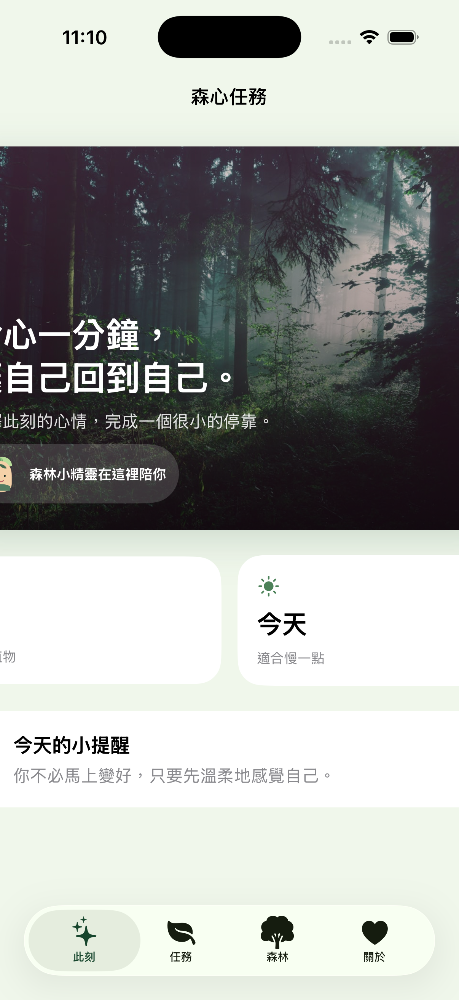

# 我用 AI 做了人生第一個 SwiftUI App：森心任務

> 副標：用 60 秒的情緒小任務，種出一座自己的心情森林。

這次我用 Xcode 與 AI 協助完成第一個 iOS App，名字叫做「森心任務」。它不是要使用者強迫自己變得正向，而是邀請使用者花一分鐘辨認當下的情緒，完成一個很小的任務，再把那次停下來照顧自己的紀錄，種成森林裡的一株植物。

## App 的玩法

App 有四個頁面：首頁、任務、我的森林與關於。

在「任務」頁，使用者可以選擇「充滿能量、有點低落、感到焦慮、平靜自在」其中一種心情。每一種心情都會對應一個 60 秒的小任務，例如深呼吸三次、找出身邊三個綠色物品，或安靜聽十秒鐘的環境聲。倒數結束後，系統會將這次心情變成一株植物，保存在「我的森林」。

## 我如何用 SwiftUI 製作它

我用 `TabView` 做四個主要頁面的底部導覽，並用 `@State` 處理目前選擇的心情與倒數狀態。任務完成時會新增一筆植物資料；再透過 `@AppStorage` 將資料編碼後留在裝置內，所以重新開啟 App 時，森林不會消失。

首頁的森林照片是網路圖片，使用 SwiftUI 的 `AsyncImage` 載入；森林小精靈與 App 圖示則放在 `Assets.xcassets`，因此是隨專案打包的本機圖片。這次也將 Lexend 字型檔放進專案，啟動時用 CoreText 註冊，並用在 App 的英文標題與數字上。

## 我請 AI 協助的過程

我先向 AI 說明作業需要一個多頁面的小遊戲，並且要有 App 名稱、圖示、專案圖片、網路圖片與客製字型。AI 建議用 SwiftUI，因為圖片、字型、iPhone 模擬器截圖與錄影都能直接在 Xcode 完成。

接著我請 AI 將原本「選心情、做一分鐘任務、收集植物」的想法整理成四頁架構。它協助我建立資料模型、倒數功能與資料保存機制，也提醒我網路圖片要有載入中的畫面，避免圖片尚未下載時出現空白。

這個過程讓我發現，AI 很適合把模糊的點子先變成可執行的第一版；但任務文字、色彩、畫面排序與每個按鈕是否真的好理解，還是要自己不斷試用後決定。

## 最終成果

完成後，我可以從首頁進入任務頁，選擇心情、完成一分鐘倒數，然後在森林頁看到新增的植物。每一株植物都記錄了當天的心情與日期，讓很短的一次自我照顧，也能留下可看見的痕跡。

## 素材來源

- 網路森林照片：[Unsplash](https://images.unsplash.com/photo-1448375240586-882707db888b?auto=format&fit=crop&w=1200&q=80)
- 本機插圖與 App 圖示：自行以 SVG 製作
- 客製字型：Lexend（隨專案提供的字型檔）

## 如果再做一次

下一版我想加入舒緩音效、讓使用者自訂任務文字，並讓森林隨著完成天數出現不同季節。這次的作品雖然很小，但它讓我第一次真的理解：App 不一定要解決很大的問題，也可以只是幫人留下一分鐘，和自己待在一起。
